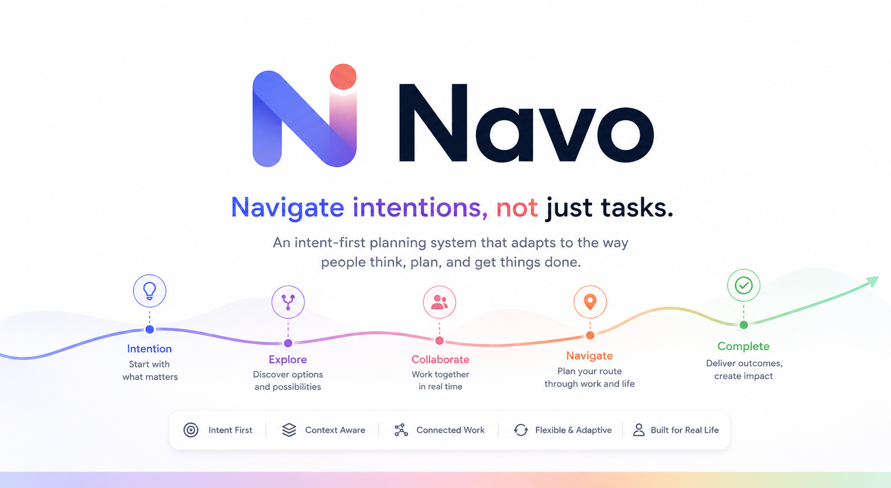
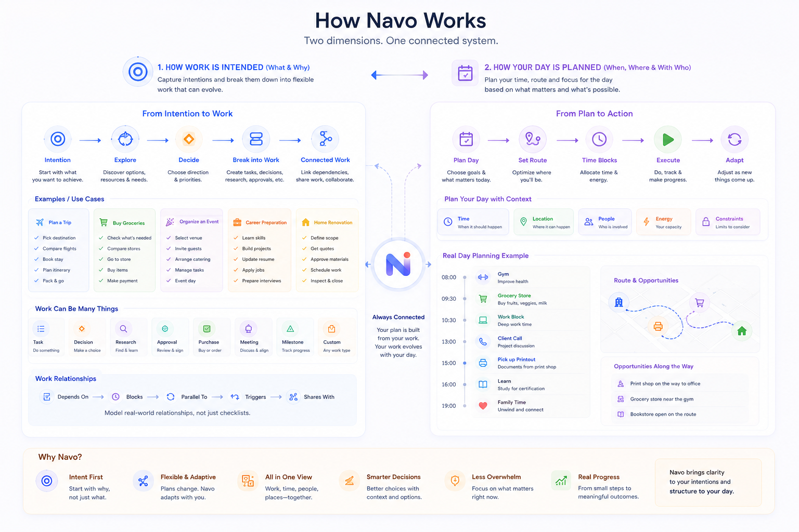

  

  
  
  
  

  
  
  

---

Navo is an intent-first planning system built around how people naturally think and work.

People rarely begin with a checklist. They begin with an intention such as planning a trip, buying groceries, preparing for an interview, or organizing an event. The details emerge over time through decisions, collaboration, changing priorities, and new opportunities.

Instead of reducing everything to isolated tasks, Navo models intentions, work, context, dependencies, people, locations, and time as one connected system.

The goal is simple: software should adapt to the way people think, not the other way around.

---

## Vision

  

Navo separates **how work is intended** from **how a day is planned**.

Intentions evolve into work. Work exists within context. The planner continuously connects the two to recommend the best path forward.

---

## Core Concepts

- **Intent** – The outcome someone wants to achieve.
- **Work** – Any action that moves an intent forward.
- **Context** – Information that influences decisions.
- **Planning** – Choosing the best path toward an outcome.
- **Scheduling** – Deciding when work should happen.

---

## What Navo Is

- An intent-first planning system.
- A connected graph of work instead of isolated tasks.
- A planning model that understands context, collaboration, and dependencies.
- A foundation for planning daily life, projects, travel, learning, and everything in between.

---

## What Navo Isn't

- A traditional to-do list.
- A flat checklist.
- A rigid project management tool.
- A calendar replacement.

---

## Documentation

### Foundation

- [Vision](VISION.md)
- [Mental Model](MENTAL_MODEL.md)
- [Design Principles](DESIGN_PRINCIPLES.md)
- [Architecture](ARCHITECTURE.md)
- [Glossary](GLOSSARY.md)

### Concepts

- [Intent](docs/concepts/intent.md)
- [Work](docs/concepts/work.md)
- [Context](docs/concepts/context.md)
- [Planning](docs/concepts/planning.md)
- [Scheduling](docs/concepts/scheduling.md)

### Specifications

- [Intent](docs/specifications/intent.md)
- [Work Item](docs/specifications/work-item.md)
- [Planner](docs/specifications/planner.md)
- [Navigation](docs/specifications/navigation.md)
- [Routing](docs/specifications/routing.md)
- [Views](docs/specifications/view.md)

### Architecture Decisions

- [Architecture Decision Records](docs/adr/README.md)

---

## Contributing

Contributions are welcome.

Before opening an issue or pull request, please read:

- [Contributing Guide](CONTRIBUTING.md)
- [Code of Conduct](CODE_OF_CONDUCT.md)
- [Security Policy](SECURITY.md)

---

## License

This project is licensed under the MIT License. See the [LICENSE](LICENSE) file for details.

---

## Author

**Mayank Kumar Gupta**

- Email: <mayankgupta690@gmail.com>
- GitHub: https://github.com/immkg
