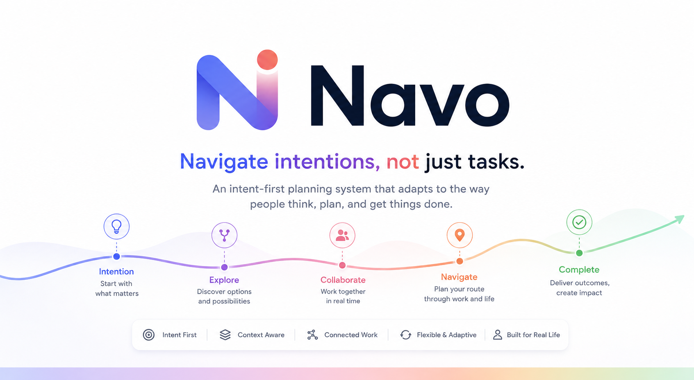

# Navo

  

  
  
  
  

  
  
  
  

---

Navo is a day planning system built around how people naturally move through the world.

Full narrative and the core insight: [VISION.md](VISION.md). Release history and what's currently in progress: [CHANGELOG.md](CHANGELOG.md).

---

## What Navo Is

**Navo is a day planning system grounded in physical reality.**

- You form **intents** — outcomes you want to achieve, carrying context from the start.
- **Work** is discovered progressively as the intent becomes clearer.
- Work happens at **locations** — first-class entities, not tags.
- **Routes** connect those locations and determine what is possible each day.
- **Opportunities** surface when location, time, and available work align.
- The **map** is the interface through which all of this becomes real.

---

## What Navo Is Not

| Not               | But                                        |
| ----------------- | ------------------------------------------ |
| A to-do list app  | A day planning system grounded in location |
| A project manager | An intent-driven life operating system     |
| A calendar app    | A route-aware opportunity engine           |
| A rigid scheduler | A continuously adapting day plan           |

Full definitions of Intent, Work, Context, Location, Route, and Opportunity: see the Glossary in [ARCHITECTURE.md](ARCHITECTURE.md).

---

## Documentation

### Foundation

- [Vision](VISION.md) — Why Navo exists and the core insight
- [Architecture](ARCHITECTURE.md) — How the system thinks, the structural model, the design principles, and the shared glossary

### Specifications

- [Intent](docs/specifications/intent.md)
- [Work Item](docs/specifications/work-item.md)
- [Day Planner](docs/specifications/planner.md)
- [Routing](docs/specifications/routing.md)

### Architecture Decisions

- [Architecture Decision Records](docs/adr/README.md)

---

## Contributing

Contributions are welcome.

Before opening an issue or pull request, please read:

- [Contributing Guide](CONTRIBUTING.md)
- [Code of Conduct](CODE_OF_CONDUCT.md)
- [Security Policy](SECURITY.md)

---

## License

This project is licensed under the MIT License. See the [LICENSE](LICENSE) file for details.

---

## Author

**Mayank Kumar Gupta**

- Email: <mayankgupta690@gmail.com>
- GitHub: https://github.com/immkg
